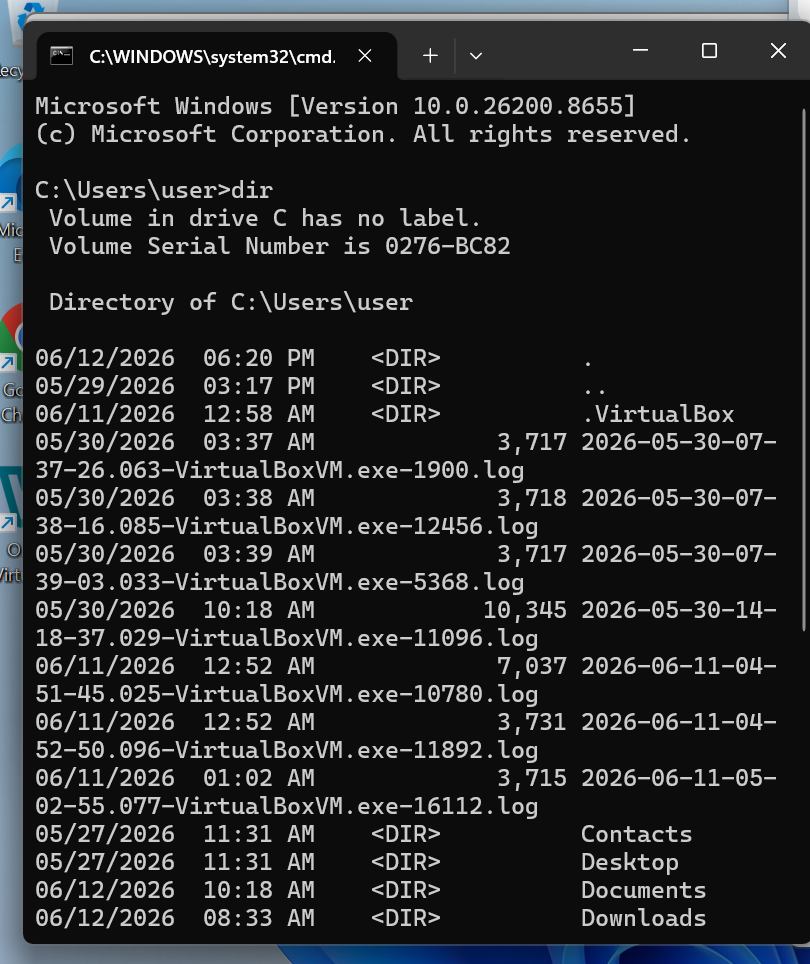
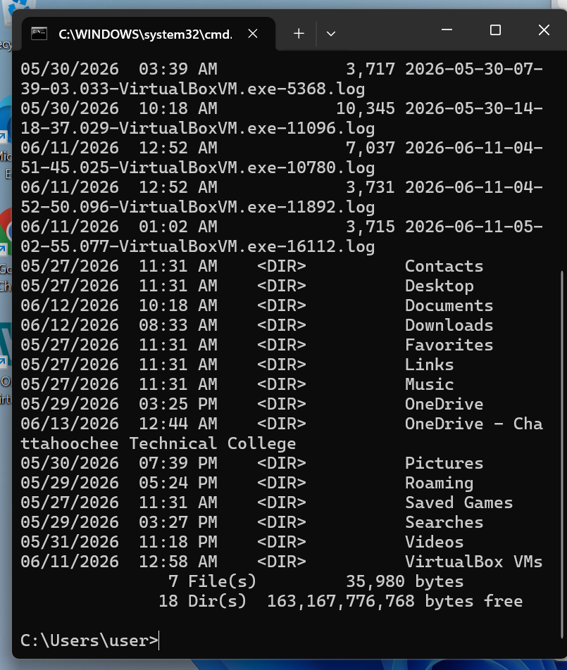
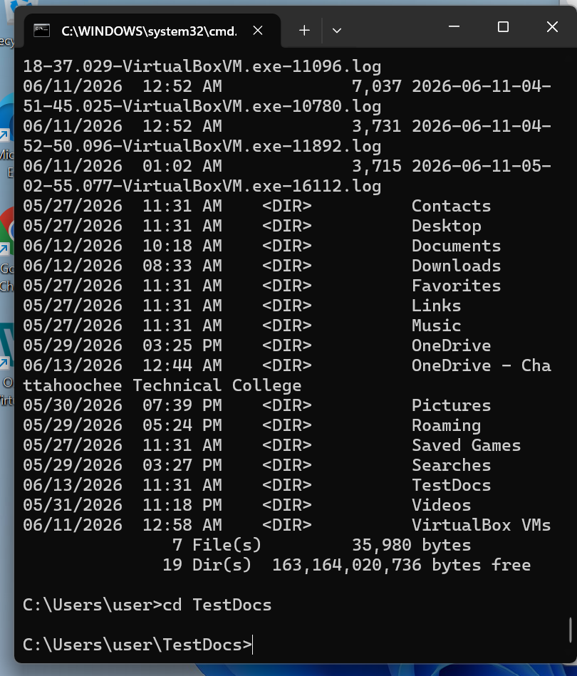
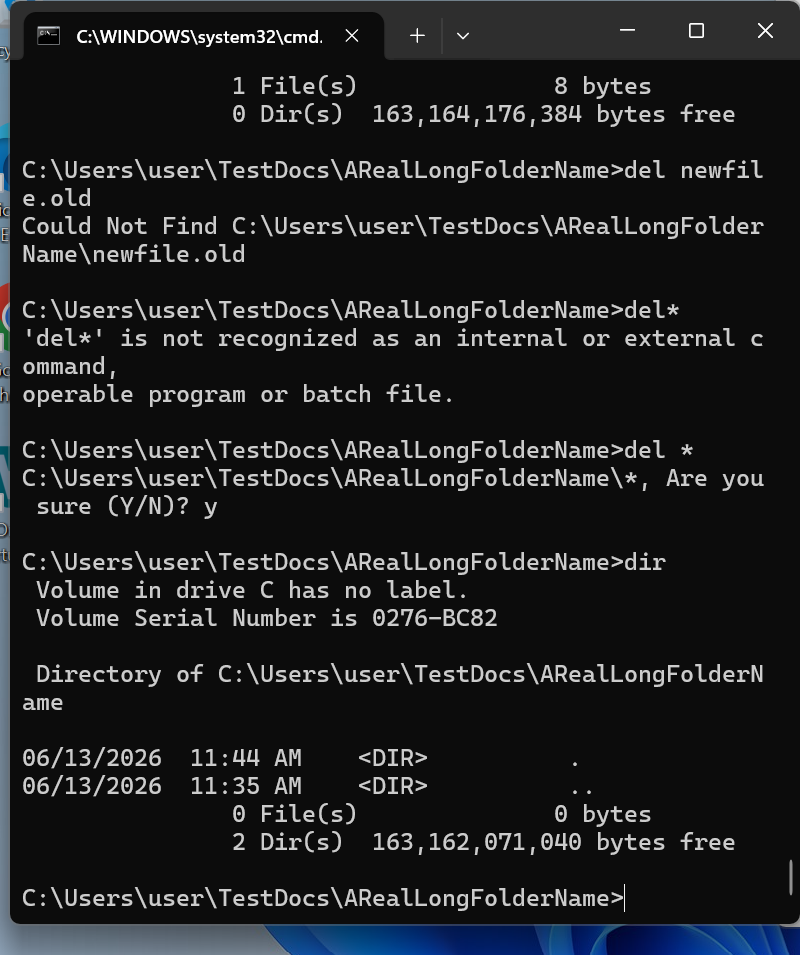

# Windows Command Line Lab

**Course:** Operating Systems Concepts, Chattahoochee Technical College
**Environment:** Windows 11 (build 26200), Command Prompt; VirtualBox installed on the same host for virtual machine work

## Goal

Manage files and folders entirely from the Windows command line, without File Explorer: navigate the file system, create a folder structure, work with files, and clean up safely.

## What I did

1. **Explored my user profile.** Ran `dir` from `C:\Users\user` to list folders and files, and read the summary lines (file count, total bytes, free disk space). See `01` and `02`.
2. **Built a folder structure.** Created a `TestDocs` folder with `mkdir`, confirmed it appeared in the next `dir` listing, then moved into it with `cd`. See `03`.
3. **Worked inside nested folders.** Created and worked inside a subfolder with a long name (`TestDocs\ARealLongFolderName`).
4. **Cleaned up with a wildcard delete.** Removed all files in the folder with `del *`. See `04`.
5. **Verified the result.** Ran `dir` again to confirm the folder was empty (`0 File(s)`).

## Troubleshooting moment

Cleanup didn't go perfectly the first time, and that's the most useful part of this lab (see `04`):

| Command | Result | What it told me |
|---|---|---|
| `del newfile.old` | `Could Not Find …` | The file had already been renamed or removed, so I checked what was actually in the folder instead of assuming. |
| `del*` | `'del*' is not recognized…` | Without a space, Windows reads `del*` as one command name. Commands and arguments must be separated. |
| `del *` | `Are you sure (Y/N)?` → `y` | Correct syntax. Windows asks for confirmation before a wildcard delete, a built-in safety check. |
| `dir` | `0 File(s)` | Confirmed the cleanup worked. |

Reading the exact error text instead of retrying blindly is the habit I'd bring to a help desk ticket.

## Commands used

| Command | Purpose |
|---|---|
| `dir` | List files and folders, with sizes and free space |
| `mkdir <name>` | Create a folder |
| `cd <name>` / `cd ..` | Move into a folder / up one level |
| `del <file>` / `del *` | Delete a file / all files in the current folder (with confirmation) |

## Screenshots

| | |
|---|---|
|  |  |
|  |  |
